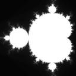
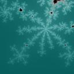

# Project 3: Parallel Mandelbrot
The goals of this project are:
- To learn how to exploit fine-grained parallelism with threads.
- To identify and protect critical sections in concurrent programs.
- To recognize and solve load imbalance prolems.
- To have a little fun with the Mandelbrot set.

Optionally, check out this inspiring background video on fractals: [Nova: Fractals: Hunting the Hidden Dimension](https://www.youtube.com/watch?v=d0Exnv8Ym7s).

## Graphics Setup
For this assignment, we will be using the [gfx library](https://github.com/dthain/gfx) to build an interactive application. 
(You may have used something similar in Fundamentals.) 
Please visit that page, follow the setup instructions, and make sure that you can run the example application before going any farther. 
 
## The Mandelbrot Set
In order to study parallelism, we must have a problem that will take a significant amount of computation. 
For fun, we will generate images in the [Mandelbrot set](http://en.wikipedia.org/wiki/Mandelbrot_set), which is a well known fractal structure. 
The set is interesting both mathematically and aesthetically because it has an infinitely recursive structure. 
You can zoom into any part and find swirls, spirals, snowflakes, and other fun structures, as long as you are willing to do enough computation. 
For example, here are three images starting from the entire set and zooming in: 




Here is the [source code](assets/code/project3/index.md) for a simple program that generates images of the Mandelbrot set and displays them in a graphics window.
Just download all of the files, run `make` to build the code and then `./fractal` to display.

This program uses the *escape time algorithm*. For each pixel in the image, it starts with the x and y position, and then computes a recurrence relation until it exceeds a fixed value or runs for max iterations.

```
static int compute_point( double x, double y, int maxiter )
{
        double complex z = 0;
        double complex alpha = x + I*y;

        int iter = 0;

        while( cabs(z)<4 && iter < maxiter ) {
                z = cpow(z,2) + alpha;
                iter++;
        }

        return iter;
}
```
Then, the pixel is assigned a color according to the number of iterations completed. 
An easy color scheme is to assign a gray value proportional to the number of iterations, but others are possible.
Here are a few color variations of the same configuration:




The `maxiter` value controls the amount of work done by the algorithm. If we increase `maxiter`, then we can see much more detail in the set, but it may take much longer to compute.
Generally speaking, you need to turn the `maxiter` value higher as you zoom in. For example, here is the same area in the set computed with four different values of `maxiter`:

**xmin .286682 xmax .287182 ymin .014037 ymax .014537**

maxiter 50 &nbsp;&nbsp;&nbsp;&nbsp;&nbsp;&nbsp;&nbsp;&nbsp;&nbsp;&nbsp;&nbsp;maxiter 100 &nbsp;&nbsp;&nbsp;&nbsp;&nbsp;&nbsp;&nbsp;&nbsp;&nbsp;&nbsp;&nbsp;maxiter 500 &nbsp;&nbsp;&nbsp;&nbsp;&nbsp;&nbsp;&nbsp;&nbsp;&nbsp;&nbsp;&nbsp;maxiter 1000


## Parallel Programming
Now, what does this all have to do with operating systems? It can take a long time to compute a Mandelbrot image. 
The larger the image, the closer it is to the origin, and the higher the `maxiter` value, the longer it will take.
You are going to use multiple threads to (safely) accelerate the computation of the image.

### Step One: Make it Interactive
Modify the provided program so that you can explore the image interactively. 
Add some code so that you can use either keystrokes or mouse clicks to zoom in, zoom out, and move up/down/left/right through the Mandelbrot set.
Additionally, when the user clicks on a location, you should recenter the image around that location. 
Also, add the ability to dynamically adjust `maxiter` by pressing a key.

Play around with the tool for a bit, and find an interesting area that takes more than ten seconds to compute. 
You can increase the computation time by either increasing the size of the window, or by increaasing the `maxiter` value to compute more detail.

Once the interactive program works as desired, keep that version in the file `fractal.c`

### Step Two: Make it Multithreaded
Copy your working `fractal.c` into a new file `fractalthread.c`.

Modify `fractalthread.c` to use multiple threads to compute the image. Each thread should compute a completely separate band of the image.
For example, if you specify three threads and the image is 600 pixels high, then thread 0 should work on lines 0-199, thread 1 should work on lines 200-399, and thread 2 should work on lines 400-599.

The number of threads should be adjustable at runtime via the keyboard.
If the user presses any of the keys 1-8, the next image should be computed using that number of threads.

Now, the trick here is that each thread is going to be using the [graphics library](https://github.com/dthain/gfx) to set the color and draw a pixel on the screen. 
Without any protection, the program will simply crash as the threads compete with each other. (In fact, you should try it, and see where it crashes)
Identify the critical section in the program and protect with a `pthread mutex`.

Explore the Mandelbrot set some more using `fractalthread`. 
It should be noticeably faster when using multiple threads, since the student machines (particularly student10-13) have a large number of cores.
However, notice that in some cases, the threads do not all finish at the same time.
If one section of the image takes longer to compute, some threads will be idle while the others are still working. 
Let's fix that problem in the next step.

### Step Three: Load Balancing with Tasks
Copy your working `fractalthread.c` into a new file `fractaltask.c`.

To solve the load imbalance, we must divide the work up into even smaller units called tasks. 
Suppose that you divide up the image into small rectanges (say, 20x20 pixels), each one a separate
task to be completed.
Declare an array (or 2d array) `tasks[i]` to keep track of which tasks have and have not been started.
Then, set up each thread such that it runs in a loop, selects the next available task, computes it, and then repeats until all tasks are complete.
Again, you must be careful because `tasks` is a data structure shared among multiple threads.
Identify the critical section and protect it with a pthread mutex.

## Hints
`pthread_create` requires that each thread execute in a function that takes exactly one argument `(void *arg)`. 
This is inconvenient, especially when you want to pass multiple arguments to the thread. 
The way around this is to define a structure `struct thread_args` that carries all of the desired arguments, and pass a pointer to that structure as the sole argument to the function.

`gfx_wait()` will wait until a mouse button or key is pressed, and then return an integer representing that mouse button or key.
In the case of a printable letter, it's just the ASCII value of that letter (treat it like a char). 
Mouse buttons and special keys are represented by unique numbers which you can discover by just printing out the return value of `gfx_wait()`.

## Turning In

This assignment is due at **5:00PM on Friday, February 18th**. 
Please review the [general instructions](general.md) for assignments.

Turn in all of your source files and a `Makefile` that builds `fractal` and `fractalthread` and `fractaltask`.  Include a `README` file that briefly describes the keyboard and mouse commands needed to operate your programs, and anything else you would like us to know.  As a reminder,
your dropbox directory is:

```
/escnfs/courses/sp22-cse-30341.01/dropbox/YOURNAME/project3
```

## Grading
Your grade will be based on:
- A correct single-threaded Mandelbrot. (30%)
- A correct implementation of multi-threaded Mandelbrot. (40%)
- A correct implementation of load-balanced Mandelbrot. (20%)
- Good coding style, including clear formatting, sensible variable names, and useful comments. (10%)

## Extra Credit Option
For five percent extra credit, add a color scheme to `fractal`. 
Turn in a (large) screenshot of the most interesting or beautiful Mandelbrot image that you can make. 
Call this file `extracredit.jpg` (or .png or .gif) so we can find it.
We will assemble a gallery of the submitted images and vote on the best one.
