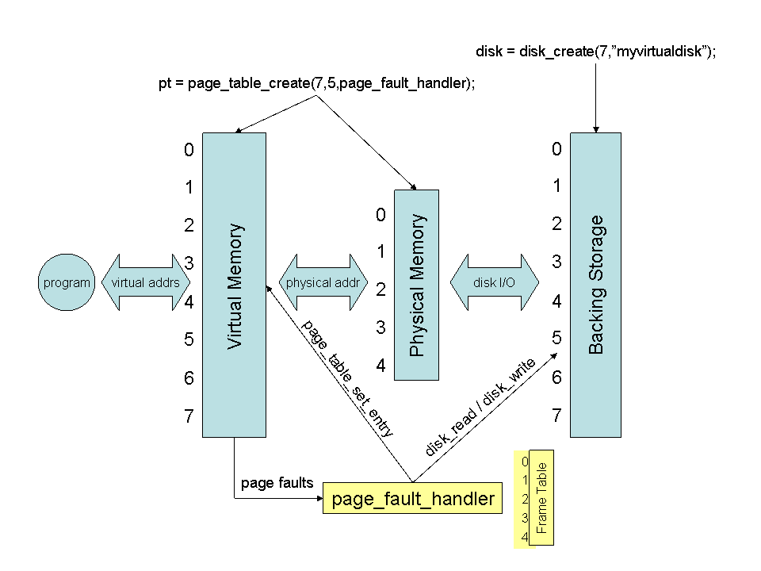

# Project 5: Virtual Memory

The goals of this project are:
- to demonstrate mastery of the virtual memory concept.
- to learn the code mechanics of operating system fault handlers.
- to develop skills in quantitative system evaluation.

## Project Overview

In this project, you will build a simple but fully functional demand paged virtual memory.
Although virtual memory is normally implemented in the operating system kernel,
it can also be implemented at the user level.  This is exactly the technique used by
modern virtual machines, so you will be learning an
advanced technique without having the headache of writing kernel-level code.
The following figure gives an overview of the components:



We will provide you with code that implements a "virtual" page table and a "virtual" disk.
The virtual page table will create a small virtual and physical memory, along with
methods for updating the page table entries and protection bits.  When an application uses
the virtual memory, it will result in page faults that call a custom handler.
Most of your job is to implement a page fault handler that will trap page faults
and identify the correct course of action, which generally means updating the page table,
and moving data back and forth between the disk and physical memory.

Once your system is working correctly, you will evaluate the performance of
several page replacement algorithms on a selection of simple programs across a range of memory sizes.
You will write a short lab report that explains the experiments, describes your results,
and draws conclusions about the behavior of each algorithm.

## Getting Started 

Begin by downloading the [source code](http://github.com/dthain/opsys-sp22/tree/main/project5/src) and building it.
Look through `main.c` and notice that the program simply creates
a virtual disk and page table, and then attempts to run one of our three "programs"
using the virtual memory.  Because no mapping has been made between virtual and
physical memory, a page fault happens immediately:

```
% ./virtmem 100 10 rand alpha
page fault on page #0
```

The program exits because the page fault handler isn't written yet.  That is your job!

Try this as a getting started exercise.  If you run the program with an equal number of
pages and frames, then you don't actually need a disk.  Instead, you can simply make
page N map directly to frame N, and do nothing else.  So, modify the page fault handler
to do exactly that:

```
page_table_set_entry(pt,page,page,PROT_READ|PROT_WRITE);
```

With that page fault handler, all of the example programs will run, cause a number of page faults,
but then run to completion.  Congratulations, you have written your first fault handler.
Of course, when there are fewer frames than pages, then this simple scheme will not do.
Instead, we must keep recently used pages in the physical memory, other pages on disk,
and update the page table appropriately as they move back and forth.

## Example Operation

The virtual page table is very similar to what we have discussed in class,
except that it does not have a reference or dirty bit for each page.
The system supports a read bit (PROT_READ), a write bit (PROT_WRITE),
and an execute bit (PROT_EXEC), which is enough to make it work.

Let's work through an example, starting with the figure below.
Suppose that we begin with nothing in physical memory.  If the application
begins by trying to read page 2, this will result in a page fault.
The page fault handler choose a free frame, say frame 3.  It then
adjusts the page table to map page 2 to frame 3, with read permissions.
Then, it loads page 2 from disk into page 3.  When the page fault handler
completes, the read operation is re-attempted, and succeeds.


The application continues to run, reading various pages.  Suppose that
it reads pages 3, 5, 6, and 7, each of which result in a page fault,
and must be loaded into memory as before.  Now physical memory
is fully in use.


Now suppose that the application attempts to write to page 5.
Because this page only has the R bit set, a page fault will result.
The page fault handler looks at the current page bits, and upon
seeing that it already has the PROT_READ bit set, adds the PROT_WRITE bit.
The page fault handler returns, and the application can continue.
Page 5, frame 1 is modified.


Now suppose that the application reads page 1.  Page 1 is not currently
paged into physical memory.  The page fault handler must decide which frame
to remove.  Suppose that it picks page 5, frame 0 at random.  Because page
5 has the PROT_WRITE bit set, we know that it is dirty.  So, the page fault
handler writes page 5 back to the disk, and reads page 1 in its place.
Two entries in the page table are updated to reflect the new situation.


## Essential Requirements

Please review the [general instructions](../general) for assignments.

The program must be invoked as follows:

```
./virtmem npages nframes rand|fifo|custom alpha|beta|gamma|delta
```

`npages` is the number of pages and `nframes` is the number of frames to create in the system.  The third argument is the page replacement algorithm.  You must implement `rand` (random replacement), `fifo` (first-in-first-out), and `custom`, an algorithm of your own invention.  The final argument specifies which built-in program to run: `alpha`, `beta`, `gamma`, or `delta`.  Each exhibits a different memory access pattern.

You may only modify the file `main.c`.  Your job is to implement three page replacement algorithms.  `rand` and `fifo` should be implemented as discussed in class.  You should invent a third algorithm, `custom` that performs better than `rand` or `fifo`.  (Better means results in fewer disk reads and writes for at least some applications.)

A complete and correct program will run each of the sample programs to completion with only the following output:

- The <strike>single line of</strike> normal output from `alpha`, `beta`, `gamma` or `delta`
- A summary of the number of page faults, disk reads, and disk writes over the course of the program.

You may certainly add some `printfs` while testing and debugging your program,
but the final version should not have any extraneous output.

You will also turn in a lab report that has the following elements:

- In your own words, briefly explain the purpose of the experiments and the experimental setup.  Be sure  to clearly state on which machine you ran the experiments, and exactly what your command line arguments were, so that we can reproduce your work in case of any confusion.

- Very carefully describe the custom page replacement algorithm that you have invented.  Make sure to give enough detail that someone else could reproduce your algorithm, even without your code.

- Measure and graph the number of page faults, disk reads, and disk writes for each program and each page replacement algorithm using 100 pages and a varying number of frames between 3 and 100.  Spend some time to make sure that your graphs are nicely laid out, correctly labelled, and easy to read.

- Explain the nature of the results.  If one algorithm performs better than another under certain conditions, then point that out, explain the conditions, and explain *why* it performs better.

## Frequently Asked Questions

- **When a page fault occurs, how can I tell if it is a read or a write?**

The page fault handler does not tell you directly.  What you need to do is look at the existing permissions on the page, and conclude that the fault is due to the missing permission.  If the page has no permissions, you should add the PROT_READ permissions and return.  If the page has PROT_READ, then you should add PROT_WRITE and continue.  (PROT_EXEC shouldn't happen in this assignment.)

- **How can I tell if a given page is written on disk or in memory?**

Call `page_table_get_entry(page,&frame,&bits)`.  If the given page has non-zero
permission bits, then it resides in the indicated frame number.  If the
permission bits are zero, then it is not in memory, and the frame number
is irrelevant.

- **Am I responsible for keeping track of which frames are free?**

Yes, you should create a frame table that keeps track of the state of each frame.
That will make it easy to find a free frame for replacement.

- **What should the contents of a page be when it is read in from disk in the first time?**

In a real operating system, the contents of a page should initially be all zeroes.  As it turns out, it does not matter for this project, since each program fills in each page with its own data before attempting to read it.

- **Why does my program get stuck in an infinite loop when there is only one page of physical memory?**

It is possible for an instruction to touch more than one page of memory.
For example, `MOV a, b` could touch three pages of memory if `a` and `b`
are in different pages, and the executable instruction is in a third page.
If there is only one page of physical memory, you will get an endless number of page faults
as you switch between the desired pages.  Just start your testing at a minimum of three pages.

- **What does the result of each program mean?**

Each of the test programs computes a result so that you can tell if it is working correctly, typically by just summing
the contents of the address space.  For a given number of virtual pages, the number should remain the same, no matter
how many physical frames are used, or what the page replacement algorithm is.  (However, if the number of pages changes,
the result will change.)  You can determine the correct result simply by using the one-line trivial page-fault handler
given above.

Here are some sample results, just to check your initial work:


program | pages | result
------|----|--------------
alpha | 10 |5222400
beta  | 10 |5232896
gamma | 10 |2220835000
delta | 10 |5201920


## Turning In

This assignment is due at <strike>5PM on Friday, April 8th</strike> **9AM on Monday, April 11th**.  Turn in all of your source code and a Makefile that builds `virtmem` when the user types `make`.  Turn in a lab report named `report.pdf` with the results indicated above.  Please do not turn in executables or other large files.  As a reminder, your dropbox is this directory:

```
/escnfs/courses/sp22-cse-30341.01/dropbox/YOURNAME/project5
```

## Grading

Your grade on this assignment will be based on the following:

- Correct implementation of demand paging with any arbitrary access pattern and amount of virtual and physical memory.  (50%)
- A lab report which is clearly written using correct English, contains an appropriate description of your experiments, contains correct results that are clearly presented, and draws appropriate conclusions. (30%) 
- Thorough attention to and handling of all possible error conditions, including user error. (10%) 
 - Good coding style, including clear formatting, sensible variable names, and useful comments. (10%) 

