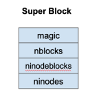

# Project 6: SimpleFS

By undertaking this project, you will:
- learn about the data structures and implementation of a Unix-like filesystem.
- learn about filesystem recovery by implementing a free block bitmap scan.
- develop your expertise in C programming by using structures and unions extensively.

**This project may be done in pairs or singletons.
Please submit your work to a single dropbox with a README
that indicates the project members.  Both will receive the same grade.**

## Overview

In this project, you will build a file system from scratch.
This filesystem is called **SimpleFS** and is very similar to the
Unix inode layer described in the textbook.   You will start
with a detailed design description of the filesystem, and
then write the code to implement it.  This will be a challenging
but fun project!

To allow you to develop and test a new filesystem without
the worry of damaging existing disks and filesystems, you
will build SimpleFS using a disk **emulator**.
A disk emulator has all the capabilities of a real disk: it loads and
stores persistent data in blocks.  It even complains
and crashes like a real disk.  The only difference is that
there are no real spinning platters: the emulator just stores
the disk data as a file in an existing file system.

To test your implemention of SimpleFS, we will provide
you with a shell that will allow you to create, format, read
and write files in your filesystem.  We will also provide you
with several example file system images so that you won't have
to start with a clean slate.

Over the course of the semester, the projects
have grown in both size and difficulty.  This project is the
largest of all, so don't leave it to the last minute.
Get started right away!

## SimpleFS Overview

The SimpleFS system has three major components: the shell, the filesystem
itself, and the emulated disk.  Your job is to implement the middle
component: the filesystem.  The following figure shows how
the components relate to each other:


At the top level a user gives typed commands to a shell, instructing
it to format or mount a disk, and to copy data in and out of the filesystem.
The shell converts these typed commands into high-level operations
on the filesystem, such as `fs_format`, `fs_mount`,
`fs_read`, and `fs_write`.  The filesystem is responsible
for accepting these operations on files and converting them into simple
block read and write operations on the emulated disk,
called `disk_read`, and `disk_write`.
The emulated disk, in turn, stores all of its data in an image file
in the filesystem.

Your job is to focus on the design and implementation of the filesystem
itself.  Before getting into the incidental details of the emulation
system, let's talk about the filesystem in some detail.

## SimpleFS Filesystem Design

SimpleFS has the following layout on disk.
It assumes that disk blocks are the common size of 4KB.
The first block of the disk is a "superblock" that describes the
layout of the rest of the filesystem.  A certain number of blocks
following the superblock contain inode data structures.
Typically, ten percent of the total number of disk blocks
are used as inode blocks.
The remaining blocks in the filesystem are used as plain data
blocks, and occasionally as indirect pointer blocks.
Here is a picture of a very small SimpleFS image:


Let's examine each of these types of blocks in detail.

The superblock describes the layout of the rest of the filesystem:



Each field of the superblock is a 4-byte (32-bit) integer.
The first field is always the "magic" number FS_MAGIC (0x30341003)
The format routine places this number into the very first bytes
of the superblock as a sort of filesystem "signature".  When the
filesystem is mounted, the OS looks for this magic number.
If it is correct, then the
disk is assumed to contain a valid filesystem.  If some other number
is present, then the mount fails, perhaps because the disk is not formatted
or contains some other kind of data.

The remaining fields in the superblock describe the layout of the filesystem.
**nblocks** is the total number of blocks, which should be the same
as the number of blocks on the disk.  **ninodeblocks** is the number of
blocks set aside for storing inodes.  **ninodes** is the total number
of inodes in those blocks.  The format routine is responsible for choosing
**ninodeblocks**: this should always be 10 percent of **nblocks**,
rounding up.  Note that the superblock data structure is quite
small: only 16 bytes.  The remainder of disk block zero is left unusued.

Each inode looks like this:


Most fields of the inode are 4-byte (32-bit) integers.
The **isvalid** field is one if the inode is valid (i.e. has been created)
and is zero otherwise.  The **size** field contains the logical size of the
inode data in bytes.  The **ctime** field is a 64-bit integer indicating
the Unix time (man time(3)) that the file was created.
  There are 3 direct pointers to data blocks, and one pointer
to an indirect data block.  In this context, "pointer" simply means the number
of a block where data may be found.  A value of zero may be used to indicate
a null block pointer.  Each inode occupies 32 bytes, so there
are 128 inodes in each 4KB inode block.

Note that an indirect data block is just a big array of pointers to further
data blocks.  Each pointer is a 4-byte int, and each block is 4KB, so there
are 1024 pointers per block.  The data blocks are simply 4KB of raw data.

You are probably noticing that something is missing: a free block bitmap!
A real filesystem would keep a free block bitmap on disk, recording one
bit for each block that was available or in use.  This bitmap would be
consulted and updated every time the filesystem needed to add or remove
a data block from an inode.

SimpleFS does not have space on disk for a free block bitmap.
So, SimpleFS requires the operating system designer (i.e. YOU)
to keep a free block bitmap in memory.  That is, there must be
an array of integers, one for each block of the disk, noting whether
the block is in use or available.  When it is necessary to allocate
 a new block for a file, the system must scan through the array
to locate an available block.  When a block is freed, it must be
likewise marked in the bitmap.

What happens when memory is lost?
Suppose that the user makes some changes to a SimpleFS filesystem,
and then reboots the system.  Without a free block bitmap, SimpleFS
cannot tell which blocks are in use and which are free.
Fortunately, this information can be recovered by scanning the disk.
Each time that an SimpleFS filesystem is mounted, the system must build
a new free block bitmap from scratch by scanning through all of the
inodes and recording which blocks are in use.
(This is much like performing an `fsck` every time the system boots.)

SimpleFS looks much like the Unix inode layer.
Each "file" is identified by an integer called an "inumber".
The inumber is simply an index into the array of inode structures
that starts in block one.
When a file is created, SimpleFS chooses the first available
inumber and returns it to the user.  All further references
to that file are made using the inumber.
Using SimpleFS as a foundation, you could easily add another layer
of software that implements file and directory names.
However, that will not be part of this assignment.

Now that you know the details of the filesystem to be implemented,
let's discuss the technical details of the emulation system.

## Disk Emulator

We provide you with a disk emulator on which to store your filesystem.
This "disk" is actually stored as one big file in the file system,
so that you can save data in a "disk image" and then retrieve it later.
In addition, we will provide you with some sample disk images that you can
experiment with to test your filesystem.

Just like a real disk, the emulator only allows operations on entire disk blocks
of 4 KB (BLOCK_SIZE).  You cannot read or write any smaller unit than than
that.  The primary challenge of building a filesystem is converting the user's
requested operations on arbitrary amounts of data into operations on fixed
block sizes.

The interface to the simulated disk is given in `disk.h`:
```
#define BLOCK_SIZE 4096

struct disk * disk_open( const char *filename, int nblocks );
int  disk_nblocks( struct disk *d );
void disk_read( struct disk *d, int blocknum, unsigned char *data );
void disk_write( struct disk *d, int blocknum, const unsigned char *data );
void disk_close( struct disk *d );
```

Before performing any sort of operation on the disk, you must call **disk_open**
and specify a (real) disk image for storing the disk data, and the number of blocks
in the simulated disk.   If this function is called on a disk image that already exists,
the contained data will not be changed.
When you are done using the disk, call **disk_close**
to release the file.  These two calls are already made for you in the shell, so you
should not have to change them.

Once the disk is initialized, you may call **disk_nblocks()** to discover the number
of blocks on the disk.  As the names suggest, **disk_read()** and
**disk_write()** read and write one block of data on the disk.  Notice that the
first argument is a block number, so a call to **disk_read(d,0,data)** reads the
first 4KB of data on the disk, and **disk_read(d,1,data)** reads the next 4KB block
of data on the disk.  Every time that you invoke a read or a write, you must ensure
that **data** points to a full 4KB of memory.

Note that the disk has a few programming conveniences that a real disk would not.
A real disk is rather finicky -- if you send it invalid commands, it will
likely crash the system or behave in other strange ways.  This simulated disk
is more "helpful."  If you send it an invalid command, it will halt the program
with an error message.  For example, if you attempt to read or write a disk
block that does not exist, you will get this error message:

```
disk_read: invalid block #592
Abort (core dumped)
```

## Filesystem Interface

Using the existing simulated disk, you will build a working filesystem.
Take note that we have already constructed the interface to the filesystem
and provided some skeleton code.  The interface is given in `fs.h`:

```
int  fs_format();
void fs_debug();
int  fs_mount();

int  fs_create();
int  fs_delete( int inumber );

int  fs_getsize( int inumber );

int  fs_read( int inumber, char *data, int length, int offset );
int  fs_write( int inumber, const char *data, int length, int offset );
```

The various functions must work as follows:

-  **fs_debug** - Scan a mounted filesystem and report on how the inodes and blocks are organized.  If you can write this function, you have won half the battle!  Once you are able to scan and report upon the file system structures, the rest is easy.  Your output from `fs_debug` should be similar to the following:
```
superblock:
    25 blocks
    3 inode blocks
    384 inodes
inode 1:
    size: 1523 bytes
    created:  Mon Mar 28 21:49:18 2022
    direct blocks: 4 
inode 3:
    size: 81920 bytes
    created:  Mon Mar 28 21:49:18 2022
    direct blocks: 5 6 7 
    indirect block: 8
    indirect data blocks: 9 10 11 12 13 14 . . .
```
-  **fs_format** - Creates a new filesystem on the disk, destroying any data already present.  Sets aside ten percent of the blocks for inodes, clears the inode table, and writes the superblock.   Returns one on success, zero otherwise.  Note that formatting a filesystem does **not** cause it to be mounted.  Also, an attempt to format an already-mounted disk should do nothing and return failure.
-  **fs_mount** - Examine the disk for a filesystem.  If one is present, read the superblock, build a free block bitmap, and prepare the filesystem for use.  Return one on success, zero otherwise.  Note that a successful mount is a pre-requisite for the remaining calls.
-  **fs_create** - Create a new inode of zero length.  On success, return the (positive) inumber.  On failure, return zero.  (Note that this implies zero cannot be a valid inumber.)
-  **fs_delete** - Delete the inode indicated by the inumber.  Release all data and indirect blocks assigned to this inode and return them to the free block map.  On success, return one.  On failure, return 0.
-  **fs_getsize** - Return the logical size of the given inode, in bytes.  Note that zero is a valid logical size for an inode!  On failure, return **-1</b  >.
-  **fs_read** - Read data from a valid inode.  Copy "length" bytes from the inode into the "data" pointer, starting at "offset" in the inode.  Return the total number of bytes read.  The number of bytes actually read could be smaller than the number of bytes requested, perhaps if the end of the inode is reached.  If the given inumber is invalid, or any other error is encountered, return 0.
-  **fs_write** - Write data to a valid inode.  Copy "length" bytes from the pointer "data" into the inode starting at "offset" bytes.  Allocate any necessary direct and indirect blocks in the process.  Return the number of bytes actually written.  The number of bytes actually written could be smaller than the number of bytes request, perhaps if the disk becomes full.  If the given inumber is invalid, or any other error is encountered, return 0.

It's quite likely that the filesystem module will need a number of global
variables in order to keep track of the currently mounted filesystem.
For example, you will certainly need a global variable to keep track
of the current free block bitmap, and perhaps other items as well.

## Shell Interface

We have provided for you a simple shell that will be used to exercise your filesystem
and the simulated disk.  When grading your work, we will use the shell to test your
code, so be sure to test extensively.
To use the shell, simply run `simplefs` with the name of a disk image,
and the number of blocks in that image.  For example, to use the `image.10`
example given below, run:
```
% ./simplefs image.10 10
```
Or, to start with a fresh new disk image, just give a new filename and number of blocks:
```
% ./simplefs mydisk 200
```
Once the shell starts, you can use the `help` command to list the available commands:
```
 simplefs> help
Commands are:
    format
    mount
    debug
    create
    delete  <inode>
    cat     <inode>
    copyin  <file> <inode>
    copyout <inode> <file>
    help
    quit
    exit
```

Most of the commands correspond closely to the filesystem interface.
For example, `format`, `mount`, `debug`,
`create` and `delete` call the corresponding functions
in the filesystem.  Make sure that you call these functions in a sensible
order.  A filesystem must be formatted once before it can be used.
Likewise, it must be mounted before being read or written.

The complex commands are `cat`, `copyin`, and `copyout`
`cat` reads an entire file out of the filesystem and displays it
on the console, just like the Unix command of the same name.  `copyin`
and `copyout` copy a file from the local Unix filesystem into your
emulated filesystem.
  For example, to copy the dictionary file into inode 10
in your filesystem, do the following:
```
 simplefs> copyin /usr/share/dict/words 10
```
Note that these three commands work by making a large number of calls to
`fs_read` and `fs_write` for each file to be copied.

## Getting Started

Download the [source code](http://github.com/dthain/opsys-sp22/tree/main/project6/src) and build it with `make`.

Included with the source are several example disk images to get you started.
The name of each disk image (image.10, image.25, image.100)tells you how many blocks are
in each image.  Each image contains some familiar files
and documents.  Once you are able to read what is on
these images, you should move on to writing and changing them.

**Note April 21st: There was a subtle error in the original image.25 and image.100. Basically, the files were too large for the size of the filesystem.  I have updated those two files, and you should download new copies.**

As provided, `shell` and `disk` are fully implemented,
and `fs` is a skeleton awaiting your work.  We have provided
the first few lines of `fs_debug` to give you the right idea.
To get started, build and run `simplefs` and call `debug`
to read and output the superblock:

```
% make
% ./simplefs image.10 10
 simplefs> debug
superblock:
    10 blocks
    2 inode blocks
    256 inodes
```

## Implementation Notes

Your job is to implement SimpleFS as described above by filling
in the implementation of `fs.c`  You do not need to change
any other code modules.
We have already created some sample data structures to get you started.
These can be found in `fs.c`.  To begin with, we have defined
a number of macros for common constants that you will use.
Most of these should be self explanatory:

```
#define BLOCK_SIZE    4096
#define FS_MAGIC           0x30341003
#define INODES_PER_BLOCK   128
#define POINTERS_PER_INODE 3 
#define POINTERS_PER_BLOCK 1024
```

Note that `POINTERS_PER_INODE` is the number of direct pointers
in each inode structure, while `POINTERS_PER_BLOCK` is the number
of pointers to be found in an indirect block.

The superblock and inode structures are
easily translated from the pictures above:

```
 struct fs_superblock {
     int32_t magic;
     int32_t nblocks;
     int32_t ninodeblocks;
     int32_t ninodes;
 };

    struct fs_inode {
     int32_t isvalid;
     int32_t size;
     int64_t ctime;
     int32_t direct[POINTERS_PER_INODE];
     int32_t indirect;
    };

```
Note carefully that many inodes can fit in one disk block.
A 4KB chunk of memory containing 128 inodes would look like this:

```
 struct fs_inode inodes[INODES_PER_BLOCK];
```
Each indirect block is just a big array of 1024 integers,
each pointing to another disk block.  So, a 4KB chunk of memory
corresponding to an indirect block would look liks this:

```
 int32_t pointers[POINTERS_PER_INODE];
```

Finally, each data block is just raw binary data used to store the partial
contents of a file.  A data block can be specified in C as simply an array
for 4096 bytes:
```
unsigned char data[BLOCK_SIZE];
```

A raw 4 KB disk block can be used to represent four different kinds of
data: a superblock, a block of 128 inodes, an indirect pointer block, or
a plain data block.  This presents a bit of a software engineering problem:
how do we transform the raw data returned by `disk_read` into each
of the four kinds of data blocks?

C provides a nice bit of syntax for exactly this problem.  We can declare
a `union` of each of our four different data types.  A `union`
looks like a `struct`, but forces all of its elements to share the
same memory space.  You can think of a `union` as several different
types, all overlaid on top of each other.

Here's an example.  We create a `union fs_block` that represents
the four different ways of interpreting raw disk data:
```
union fs_block {
    struct fs_superblock super;
    struct fs_inode      inodes[INODES_PER_BLOCK];
    int                  pointers[POINTERS_PER_BLOCK];
    unsigned char        data[BLOCK_SIZE];
};
```
Note that the size of an `fs_block` union will be exactly 4KB:
the size of the largest members of the union.  To declare a variable
of type: `union fs_block`:

```
union fs_block block;
```

Now, we may use `disk_read` to load in the raw data from block zero.
We give `disk_read` the variable `block.data`, which looks
like an array of characters:

```
disk_read(d,0,block.data);
```

But, we may interpret that data as if it were a `struct superblock` by
accessing the `super` part of the union.  For example, to extract
the magic number of the super block, we might do this:

```
x = block.super.magic;
```

On the other hand, suppose that we wanted to load disk block 59, assume that it
is an indirect block, and then examine the 4th pointer.
Again, we would use `disk_read` to load the raw data:

```
disk_read(d,59,block.data);
```

But then use the `pointer` part of the union like so:

```
x = block.pointer[4];
```

The union offers a convenient way of viewing the same data from multiple
perspectives.  When we load data from the disk, it is just a 4 KB raw chunk
of data (block.data).  But, once loaded, the filesystem layer knows that
this data has some structure.  The filesystem layer can view the same data
from another perspective by choosing another field in the union. (block.super)

## General Advice

-  **Get started early!**  This project is larger and harder than the previous projects. Don't wait until the last minute.
-  **Implement the functions roughly in order.**  We have deliberately presented the functions of the filesystem interface in order to difficulty.  Implement debug, format, and mount first.  Make sure that you are able to access the sample disk images provided.  Then, perform creation and deletion of inodes without worrying about data blocks.  Implement reading and test again with disk images.  If everything else is working, then attempt fs_write.
-  **Divide and conquer.**  Work hard to factor out common actions into simple functions.  This will dramatically simplify your code.  For example, you will often need to load and save individual inode structures by number.  This involves a fiddly little computation to transform an inumber into a block number, and so forth.  So, make two little functions to do just that:
```
void inode_load( int inumber, struct fs_inode *inode ) { ... }
void inode_save( int inumber, struct fs_inode *inode ) { ... }
```
Now, everywhere that you need to load or save an inode structure, call these functions.
Anytime that find yourself writing very similar code over and over again,
factor it out into a smaller functio
-  **Test boundary conditions.**  We will certainly test your code by probing
its boundaries.  Make sure that you test and fix boundary conditions before handing in.
For example, what happens if `fs_create` discovers that the inode table is full?
It should cleanly return with an error code.  It certainly should not crash the program
or mangle the disk!  Think critically about other possible boundary conditions such
as the end of a file or a full disk.
-  **Don't worry about performance.**  You will be graded on correctness, not performance.  In fact, during the course of this assignment, you will discover that a simple file access can easily erupt into tens or hundreds of single disk accesses.  Understand why this happens, but don't worry about optimization.

## Turning In

This assignment is due at **5PM on Tuesday April, 26th**.  a Makefile, and a brief
README listing your project members to one of your dropboxes.  (It isn't necessary to turn it into both.)
Please do not turn in executables, disk images, or other files.  As a reminder, your dropbox
directory is:

```
/escnfs/courses/sp22-cse-30341.01/dropbox/YOURNAME/project6
```

